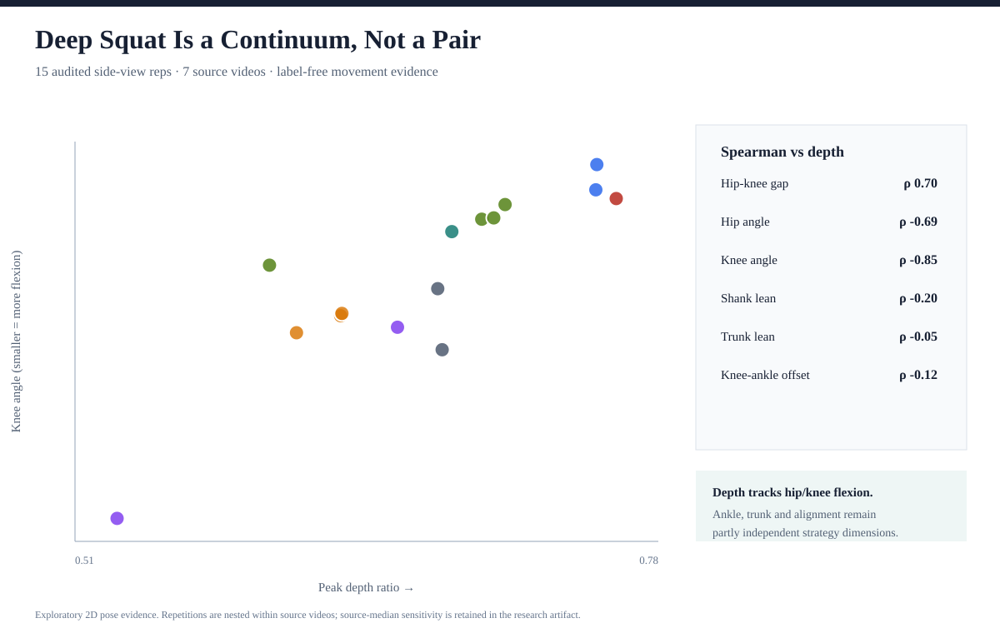
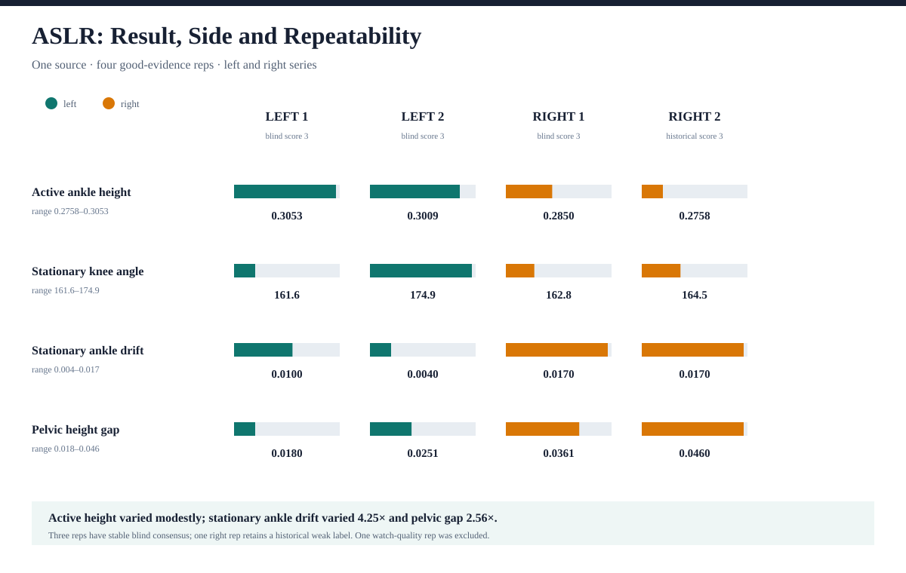
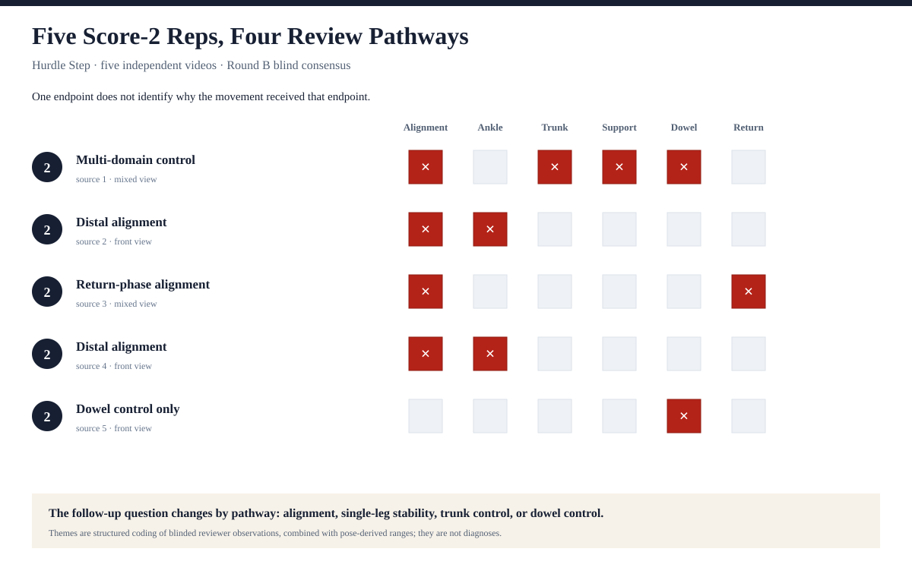
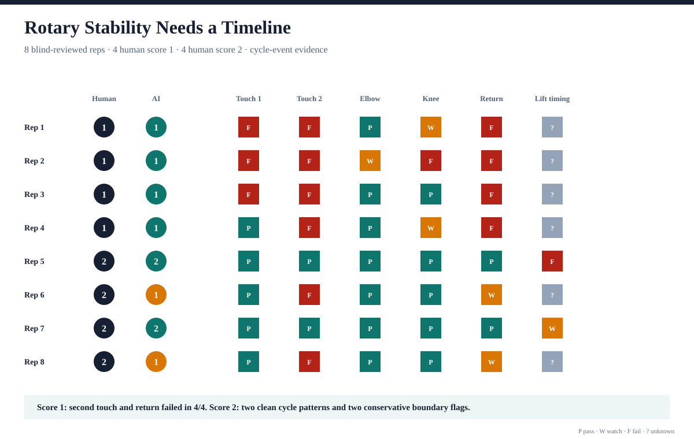

# AI-FMS

AI-FMS 是一个 **AI-assisted、human-in-the-loop 的 Functional Movement
Screen 视频标注、定量动作特征和研究数据平台**。它帮助 reviewer 对视频中的动作
rep 进行切分、盲法评分、pose evidence 检查、分歧复核和可追溯导出。

项目不进行医疗诊断、伤病风险预测或自动 pain detection，也不替代 certified FMS
professional。当前 AI 总分是可解释的研究性提示层，不是经过独立验证的自动评分器。

## 当前阶段

| 项目                 | 当前状态                                           |
| -------------------- | -------------------------------------------------- |
| 产品工作流           | 7 个 FMS movements 的 annotation workflow          |
| 核心研究数据         | 4 个动作、28 个唯一视频、110 个 reps               |
| Pose/feature 数据    | 29/29 pose assets；66/110 feature-ready            |
| 正式盲审             | 32 reps，四动作各 8；Round A/B 均已完成            |
| Round B 人工证据     | 32/32 status 一致；26/26 可评分条目完全同分        |
| AI/人工探索性比较    | Locked Phase I AI：16/25 exact；23/25 within one   |
| ASLR pose 证据审计   | 16 个独立窗口：11 good、2 watch、3 limited         |
| ASLR ROI sensitivity | 原 3 个 limited → 1 good、2 watch、0 limited       |
| 七动作 AI workflow   | 七个动作均具备 first-pass pose-based AI suggestion |
| 定量案例与图表       | 4 种差异化分析；4 张无人物数据驱动图               |
| 历史标签审计         | 25 条稳定盲审共识中，18 条确认历史 weak label      |
| 当前等待项           | Held-out confirmation、公开素材审计与 demo         |

四个 pilot actions：

- Deep Squat
- Hurdle Step
- Active Straight Leg Raise
- Rotary Stability

七个 FMS 动作均使用统一的 annotation、pose evidence、first-pass AI suggestion、
human confirmation 和 traceable export framework。Deep Squat 使用 staged protocol；
Rotary Stability 使用完整周期证据；各动作都可以在证据不足时 abstain。AI suggestion
不进入 blind Study Mode，当前 AI-human 结果属于 internal benchmark，不是独立验证。

## 项目价值

传统 FMS 使用 0-3 ordinal score 表达规则结果。AI-FMS 保留这个人工评分框架，同时
增加角度、相对距离、动作轨迹、稳定性 proxy 和 pose quality。项目目前最有价值的
发现不是“AI 可以代替人工”，而是：

> FMS 0-3 分可能同时压缩连续动作策略、左右与重复性、规则扣分路径以及时间事件顺序；
> pose-derived evidence 可以按动作特性恢复这些不同类型的信息。

研究从完整 110-rep pool 出发，没有把四个动作机械地写成同一种 pair comparison：

- **Deep Squat**：15 条审计后侧视 rep、7 个源视频，用连续谱和 rank correlation
  分离深度/髋膝屈曲轴与踝、躯干、对线策略；
- **ASLR**：同一来源的四条 good-evidence rep，用 bilateral repeatability series
  检查目标高度、固定腿和骨盆控制是否同步；
- **Hurdle Step**：五条来自五个视频的盲评 2 分，经 thematic coding 得到多领域控制、
  远端对线、回收阶段对线和 dowel control 四种 review pathway；
- **Rotary Stability**：八条盲评 rep 的 full-cycle event matrix，保留两次触踝、伸展、
  离地时序和回位信息。

这些分析分别回答不同问题，也有不同证据等级。ASLR subject selection、Hurdle
camera-view gate 和 pose/timing failure 继续作为 measurement QA。所有功能性解释均是
待验证假设，不作疾病、伤病风险或已确认障碍的诊断。









## 系统组成

### Workbench

- React/Vite 本地应用。
- 视频上传、duration-aware 范围、rep 列表和 loop playback。
- Segment timing、camera view、side、Deep Squat `attemptCondition` 和 clearing/pain
  metadata。
- 真实 MediaPipe pose overlay、timing QA 和 movement-specific feature snapshot。
- Reviewer scoring、AI evidence、adjudication、JSON/CSV/package export。

### Study Mode

- Round A blind review 与 Round B 隔离 namespace。
- Round A 和 Round B 均隔离历史分数、AI 分数、pose-derived 参数、源文件名
  和音频标签提示。
- Round B 是间隔约 51 小时后、重新随机的第二次独立盲评；锁定 AI 只在签名导出
  完成后由分析脚本读取。
- Append-only review events、foreground review time、confidence、comment 和
  unscorable taxonomy；校验器会拒绝 Round B 中的 AI/pose evidence 暴露。
- 完整 export 的 manifest/fingerprint/schema/SHA-256 校验。
- 签名 JSON 进入本地 SQLite 研究数据库，导入按 checksum 幂等。

### Research Pipeline

- 28 个 history 文件去重形成 canonical pilot。
- 稳定 `videoId`、`ingestId`、`repetitionId` 与 asset checksum。
- 110-rep blindability、camera-view 和 feature-quality 审计。
- 66-rep label-free profiles、source-video effect 和 leave-one-video-out stability。
- 26-rep Round A consensus overlay、case-study queue 和 AI evidence comparison。
- 九条 AI/人工差异的 5 帧视觉复核与 protocol sensitivity。
- 全部 17 条 ASLR 记录的 label-free side/peak evidence audit。
- 三个 ASLR limited 窗口的 subject-aware ROI sensitivity 与两个 watch 视频 QA。
- Rotary Stability 的两次 hand-to-ankle、肘膝伸展、离地时序、回位与 clearing gate。
- 双 reviewer closeout、逐 reviewer A/B change 与 locked AI-human benchmark。
- 历史标签抽检审计：只将与双轮稳定盲审共识完全一致的 18 条正式样本升级为
  `audited weak labels`，其余历史标签继续保留为 weak-label provenance。

## 研究证据边界

Round B 两位 reviewer 在全部 32 条上 status 一致，其中 26 条双方均可评分且
26/26 同分，6 条均判为 unscorable 且原因一致；linear 与 quadratic weighted
Cohen's kappa 均为 1.0000。两位 reviewer 从 Round A 到 Round B 各改变 1 条数值
分数，且改变的是同一条 Hurdle Step。这个结果反映本轮人工审核的一致性和复测稳定性，
不证明 AI 准确，也不能外推到更大的 reviewer population。

现有 AI 与人工共识比较：

| 分析                        | 人工参考 | 可比较 | 完全同分 | 相差不超过 1 分 |    MAE |
| --------------------------- | -------- | -----: | -------: | --------------: | -----: |
| Locked Phase I AI benchmark | Round B  |     25 |    16/25 |           23/25 | 0.4400 |

锁定 AI 在 32 条中有 28 条输出分数；与人工数值共识的交集为 25 条，linear weighted
kappa 为 0.4917。它只能称为 internal benchmark，不能称为 held-out validation 或
模型准确率。

32-rep 审计也用于判断历史标签能否继续利用：25 条具有稳定双轮数值共识，其中 18 条
与历史标签完全一致，6 条稳定不一致，1 条历史分数缺失。它说明历史标签具有一定的
ordinal reference value，但不能证明 110 条全部有效；目前只把这 18 条标记为经盲审
确认的 audited weak labels，不改写 canonical 历史记录。

ASLR subject-aware sensitivity 另把三个原 `limited` 窗口重提取为 1 `good`、
2 `watch`、0 `limited`。该结果说明部分失败来自 subject selection / crop；它不回写
冻结 evidence，也不属于 AI score accuracy improvement。

## 界面截图


## 本地运行

安装依赖并启动：

```bash
npm install
npm run dev
```

主要页面：

- Workbench：`http://127.0.0.1:5173/`
- Study Mode Round A：`http://127.0.0.1:5173/study.html?round=a`
- Study Mode Round B：`http://127.0.0.1:5173/study.html?round=b`
- Video Manager：`http://127.0.0.1:5173/video-manager.html`

本地 HTTP API stub：

```bash
npm run api:stub
npm run dev:real
```

质量门：

```bash
npm run check
```

当前质量基线为 lint、Prettier、自动测试和三个 Vite entry builds；以最近一次
`npm run check` 输出为准。

## 研究复现

以下命令依赖本机被 Git 忽略的 `Ingested-data/`、视频和 pose assets。原始媒体不会
进入代码仓库。

构建 canonical 数据与 feature matrix：

```bash
npm run data:pilot:build
npm run data:pilot:features
npm run data:pilot:camera-views
npm run data:pilot:features:camera-audited
```

重建完整数据利用与 label-free profiles：

```bash
npm run data:pilot:utilization
npm run data:pilot:profiles:label-free
```

重建 Round A 分析：

```bash
npm run study:reviews:agreement -- /path/reviewer-a.json /path/reviewer-b.json
npm run study:profiles:round-a
npm run study:ai-evidence:round-a
npm run study:ai-evidence:audit-previews
npm run study:aslr:side-peak-audit
```

重建双轮 closeout 与历史标签审计：

```bash
npm run study:closeout:round-b -- /path/round-a-a.json /path/round-a-b.json /path/round-b-a.json /path/round-b-b.json
npm run study:labels:audit
```

重建申请案例组合与无人物图表：

```bash
npm run release:phase-i:figures
```

研究数据库：

```bash
npm run data:pilot:db:ingest
npm run data:pilot:db:status
npm run study:reviews:db:status -- --pilot-id ai-fms-four-movement-core-2026-08-09 --round round_a
```

## 文档入口

- 统一计划：`docs/plans/ai_fms_4_week_closeout_plan_2026-08-09.md`
- Phase I dataset card：`docs/research/ai_fms_phase_i_dataset_card_2026-08-09.md`
- Methods、limitations 与 ethics：
  `docs/research/ai_fms_phase_i_methods_limitations_ethics_2026-08-09.md`
- Phase I technical report：
  `docs/reports/ai_fms_phase_i_technical_report_2026-08-09.md`
- Application copy：`docs/ai_fms_phase_i_application_copy_2026-08-09.md`
- Application evidence table：
  `docs/ai_fms_phase_i_application_evidence_table_2026-08-09.md`
- 数据字典：`docs/research/pilot_v1_data_dictionary.md`
- Round A agreement：私有 generated report + checksum，主要数字已进入 technical report
- Round B closeout：私有 generated report + checksum，主要数字已进入 technical report
- 历史标签审计：私有 generated report + checksum，主要数字已进入 dataset card
- AI/人工比较：`docs/research/round_a_ai_consensus_evidence_2026-08-09.md`
- 九条差异复核：
  `docs/research/round_a_targeted_ai_difference_audit_2026-08-09.md`
- ASLR 侧别与峰值证据审计：
  `docs/research/aslr_side_peak_evidence_audit_2026-08-09.md`
- ASLR subject-aware sensitivity：
  `docs/research/aslr_subject_aware_sensitivity_2026-08-10.md`
- Phase I 案例组合与申请图：
  `docs/research/phase_i_case_study_portfolio_2026-08-10.md`

## Repository Layout

- `src/`：Workbench、Study Mode 与 Video Manager。
- `src/lib/`：动作 timing/features、scoring、review、export 和 analysis logic。
- `server/`：本地 API stub 与 Video Manager API。
- `scripts/`：数据构建、pose、study、分析和文档输出工具。
- `research/pilot-v1/`：source-of-truth contracts、audit decisions 和生成说明。
- `research/pilot-v1/generated/`：私有、可重建、被 Git 忽略的研究输出。
- `Ingested-data/`：私有 review exports 与 SQLite，Git ignored。
- `Eval_Videos/`：本地视频与 pose assets，Git ignored。
- `docs/`：规格、研究报告、计划和申请输出。
- `tests/`：Node test suite。

## 数据、隐私与发布

- 视频来源混合，部分只适合本地研究复核；没有完成 rights audit 的媒体不得公开。
- 当前数据不包含受控参与者招募、人口统计、临床结果或 injury outcome。
- Reviewer comments、原始视频、raw pose 和本地绝对路径不进入公开申请包。
- `0` 只表示观察或报告的 pain；无法按协议独立评分使用 `unscorable`，不能写成 0。
- 历史 97 条 numeric labels 默认仍是 weak-label provenance；正式样本中只有 18 条已被
  双轮稳定盲审共识确认，可标记为 audited weak labels。
- 所有结果都应表述为 exploratory pilot evidence，不做 clinical generalization。

## 下一阶段

1. 为 Hurdle 增加 cycle-level knee/ankle、trunk 和 dowel-orientation evidence。
2. 为 ASLR 补充主体明确、侧别与完整峰值可见的新来源视频，验证当前低分差异。
3. 为 Rotary 补采手脚无遮挡、board edge 可见、完整侧身的新来源视频，作为 held-out
   confirmation；不使用正式 8 条继续调参。
4. 将四张差异化研究图整合进 project page 与 demo；现有 ASLR subject-aware 图保留为
   方法 QA 补充材料。
5. 完成公开素材 rights/privacy audit、demo video 和最终 release manifest。
