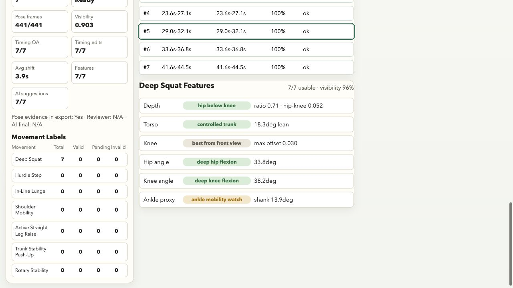
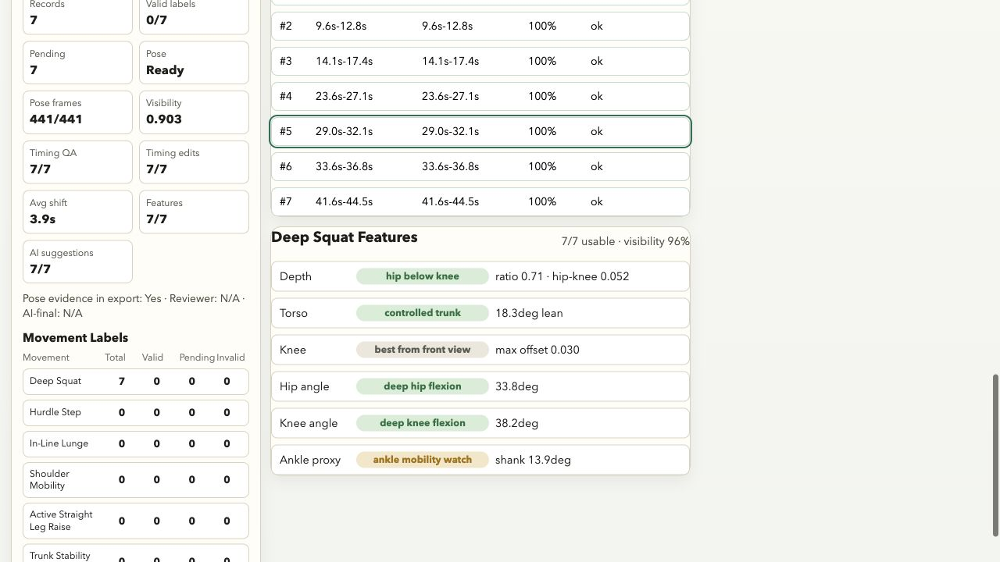

# AI-FMS / 03-FMS-Calib

AI-FMS is being restarted as an **AI-assisted, human-in-the-loop Functional
Movement Screen video annotation and movement-quality dataset platform**.

The project should not be presented as a fully automatic FMS scoring or medical
diagnosis tool. Its near-term goal is to help reviewers produce consistent,
traceable FMS movement labels and to build the data foundation for future
movement-quality models.

## Current Positioning

Application-facing summary:

> AI-FMS helps reviewers segment FMS videos, inspect pose-based movement
> features, compare AI suggestions with human labels, adjudicate disagreements,
> and export traceable training data for future movement-quality models.

This framing aligns with Ronnie's application direction:

- long-term competitive swimming and endurance discipline,
- Human Movement Science / Kinesiology / Exercise Science interests,
- FMS learning and movement-quality observation,
- AI-assisted sports health technology.

## Demo Screenshots






## Scope Strategy

The restarted project uses a layered scope:

- **V1: Seven-movement annotation platform**
  - all 7 FMS movements,
  - upload, playback, segment list, loop review,
  - Reviewer A/B scoring,
  - AI suggestion placeholder,
  - adjudication and export.
- **V1.5: Deep Squat flagship AI pipeline**
  - real pose extraction,
  - aligned keypoint overlay,
  - Deep Squat motion features,
  - pose-assisted segmentation,
  - explainable AI suggested score.
- **V1.7: Selected multi-movement expansion**
  - priority: Active Straight Leg Raise, Shoulder Mobility, Hurdle Step,
    In-Line Lunge.
- **V2: Application and research package**
  - dataset card,
  - evaluation metrics,
  - technical report,
  - demo video,
  - project page.

See [V1.5 Scope and Roadmap](docs/specs/v1_5_scope_and_roadmap.md) for the
full plan.

## Existing Prototype

The current codebase already includes:

- React/Vite calibration workbench.
- 7 FMS movement entries:
  - Deep Squat
  - Hurdle Step
  - In-Line Lunge
  - Shoulder Mobility
  - Active Straight Leg Raise
  - Trunk Stability Push-Up
  - Rotary Stability
- Video upload and duration-aware Start/End defaults.
- Expected Reps and Notes-assisted segment generation.
- Segment list and loop playback.
- Segment metadata editor for manual start/end correction, side, pain flag,
  clearing test, and rubric version.
- Reviewer A/B score forms.
- AI suggestion placeholder / rules-based scoring.
- A/B/AI adjudication rules.
- Readiness and consistency snapshot cards.
- Reviewer agreement and AI-final agreement dashboard metrics.
- JSON and CSV dataset export for the current mock/stub workflow, including
  optional pose-derived evidence.
- Optional MediaPipe pose JSON upload and real keypoint overlay for playback.
- Deep Squat pose-assisted timing QA and batch segment quality report.
- Deep Squat feature snapshot for depth, torso control, knee alignment, and
  side-view hip/knee/ankle angle evidence.
- Pose-based explainable Deep Squat suggestion with confidence and reasons.
- Export Evidence dashboard card for label completion, pose coverage, timing
  QA, feature coverage, and suggestion coverage.
- Segment timing correction summary for manual boundary edits and average
  timing shift.
- Movement-level valid/pending/invalid label summary for all 7 FMS action
  slots.
- Mock API and local HTTP API stub.
- Manifest validation and batch import/report scripts.
- Automated tests for segmentation, adjudication, consistency, mock API, and
  manifest utilities.

The workbench can now load generated MediaPipe pose JSON and render real
keypoints over the playback surface. If no pose JSON is loaded, the overlay
falls back to an explicitly labeled demo skeleton and should not be treated as
model output.

## Repository Layout

- `src/`: React/Vite workbench.
- `src/lib/`: segmentation, adjudication, consistency, and AI suggestion logic.
- `src/api/`: mock/real API adapters.
- `server/api-stub.js`: local HTTP API stub for real-mode integration.
- `scripts/`: manifest validation, import/report tooling, PDF brief generator.
- `docs/specs/`: product and technical specs.
- `docs/backlog.md`: restarted roadmap and task queue.
- `docs/dataset_card_deep_squat_v1_5_draft.md`: Deep Squat dataset card draft.
- `docs/sample_video_inventory.md`: current seven-movement sample video
  inventory and quality notes.
- `docs/demo_dry_run_checklist_ai_fms_v1_5.md`: reproducible Deep Squat demo
  QA checklist and screenshot references.
- `docs/testing_handoff_ai_fms_v1_5.md`: current user testing handoff for the
  V1.5 Deep Squat demo.
- `docs/AI-FMS_project_brief_application.md`: application-facing project brief.
- `docs/demo_walkthrough_script_ai_fms_v1_5.md`: 2-3 minute demo script.
- `docs/technical_report_outline_ai_fms_v1_5.md`: technical report outline.
- `docs/application_package_notes_ai_fms_v1_5.md`: application package and
  project page notes.
- `docs/project_page_copy_ai_fms_v1_5.md`: public-facing project page copy and
  resume/demo wording.
- `db/migrations/0001_v0_init.sql`: legacy V0 database draft.
- `Eval_Videos/`: local evaluation video assets and manifests.
- `tests/`: Node test suite.

## Local Development

Install dependencies:

```bash
npm install
```

Run the default mock-mode workbench:

```bash
npm run dev
```

Run local HTTP API stub in another terminal:

```bash
npm run api:stub
```

Run the frontend against the local API stub:

```bash
npm run dev:real
```

Run the quality gate:

```bash
npm run check
```

Check the current four-movement demo readiness:

```bash
npm run demo:check:four
```

Run the four-movement end-to-end mock workflow smoke:

```bash
npm run demo:flow:four
```

Run the current seven-action end-to-end mock workflow smoke:

```bash
npm run demo:flow:seven
```

## Seven-Action Demo Path

For the current V1.5/V1.7 local demo:

1. Run `npm run dev` and open the workbench.
2. Choose one of the built-in `Demo Preset` options and click `Load Demo` to
   preload the video and matching pose JSON.
3. Click `Start Analysis`.
4. Review the unified segment list, Timing QA, feature snapshot, and AI / pose
   evidence panel.
5. Export JSON, CSV, or Package to inspect the traceable dataset record.

Current browser-testable presets:

- `Sample-1 mixed views`: Deep Squat flagship pipeline with pose-based AI
  suggestion.
- `ASLR score-3 sample`: Active Straight Leg Raise implemented pose pipeline
  with pose-based AI suggestion.
- `Shoulder score-2 sample`: Shoulder Mobility pose pipeline with first-pass
  pose-based AI suggestion.
- `Hurdle score-3 sample`: Hurdle Step pose pipeline with first-pass
  pose-based AI suggestion.
- `In-Line Lunge score-3 sample`: In-Line Lunge pose pipeline with first-pass
  pose-based AI suggestion.
- `Trunk Stability Push-Up score-3 sample`: annotation-only workflow path.
- `Rotary Stability review-only sample`: annotation-only workflow path; current
  sample is not yet a final movement-quality demo video.

The reproducible dry-run checklist is
`docs/demo_dry_run_checklist_ai_fms_v1_5.md`.

The current four-movement testing handoff is
`docs/four_movement_testing_handoff_2026-05-23.md`.

The current seven-action testing handoff is
`docs/seven_action_testing_handoff_2026-05-23.md`.

## Evaluation Video Workflow

Validate the Deep Squat manifest:

```bash
npm run videos:validate:deep_squat
```

Inventory the collected seven-movement sample videos and generate draft sample
manifests:

```bash
npm run videos:inventory:samples
npm run videos:validate:samples
```

The inventory report lives at `docs/sample_video_inventory.md`. Draft manifests
live under `Eval_Videos/Sample videos/manifests/`; they are intentionally kept
separate from the canonical movement manifests until a reviewer chooses which
rows should be promoted.

Discover online FMS video candidates without downloading them:

```bash
YOUTUBE_API_KEY=... npm run videos:discover:web -- --action rotary_stability --max-results 10
```

The discovery command writes a review-only registry at
`Eval_Videos/online-candidates/fms-video-candidates.json` and a Chinese review
report at `docs/online_fms_video_candidates.md`. It compares candidate titles
and durations against local videos so likely duplicates are visible before any
download happens.

Download is intentionally gated. A candidate must be manually changed to
`approvedForDownload: true`, and its `rightsStatus` must be changed to a
confirmed value such as `permission_confirmed`, `owned_by_project`,
`creative_commons_confirmed`, `public_domain_confirmed`, or
`platform_download_permitted` before this command will download anything:

```bash
npm run videos:download:approved
```

Downloaded files go to `Eval_Videos/Online Candidates/` first. They should stay
there until a human reviewer confirms action type, quality, reps, score notes,
and source rights before any row is promoted into a canonical movement
manifest.

Run the FMS Video Download Manager sub-feature:

```bash
npm run api:video-manager
npm run dev:manager
```

Then open `http://127.0.0.1:5173/video-manager.html`, or use the `Video Manager`
entry at the bottom of the workbench left column. The manager is a sub-feature
of AI-FMS, but it runs as an independent page so video discovery/download work
does not disturb annotation and scoring state. It lists all 7 FMS actions,
shows downloaded raw videos and existing reference samples, searches YouTube
candidates through the official API, ranks recommendations, requires a download
confirmation, and keeps new downloads in the isolated Online Candidates library.
See `docs/video_manager_subfeature.md` for the product boundary and safe
development areas.

Validate other movement manifests after adding rows:

```bash
npm run videos:validate:hurdle_step
npm run videos:validate:in_line_lunge
npm run videos:validate:shoulder_mobility
npm run videos:validate:active_straight_leg_raise
npm run videos:validate:trunk_stability_push_up
npm run videos:validate:rotary_stability
```

Seed the API stub from a manifest:

```bash
npm run videos:seed:stub:deep_squat
```

Generate a consistency report:

```bash
npm run report:consistency:deep_squat
```

## Application Brief PDF

The application-facing brief lives at:

- `docs/AI-FMS_project_brief_application.md`
- `docs/AI-FMS_project_brief_application.pdf`

The current PDF was regenerated from the Chinese brief and verified as an
8-page document with extractable text.

Regenerate the PDF with the bundled Codex runtime Python, which includes
ReportLab:

```bash
/Users/edwardzhu/.cache/codex-runtimes/codex-primary-runtime/dependencies/python/bin/python3 scripts/generate-application-brief-pdf.py
```

## Near-Term Build Order

Recommended next sprint:

1. Promote selected draft sample-manifest rows into canonical movement
   manifests after reviewer confirmation.
2. Record the Deep Squat flagship demo using
   `docs/demo_walkthrough_script_ai_fms_v1_5.md`.
3. Prepare a public-facing project page from
   `docs/project_page_copy_ai_fms_v1_5.md`.
4. Choose the next movement-specific pose feature target after sample review.

## Pose Extraction Prototype

Install the optional pose pipeline dependencies in a local Python environment:

```bash
python3 -m venv .venv
.venv/bin/python -m pip install -r requirements-pose.txt
```

The first verified local combination is `mediapipe==0.10.21` with the
dependency-provided OpenCV package. Newer MediaPipe wheels may expose different
macOS graphics-context behavior, so keep this pin until we deliberately retest.

Download the lightweight official MediaPipe Pose Landmarker model:

```bash
.venv/bin/python scripts/download-pose-landmarker-model.py \
  --variant lite \
  --output models/pose_landmarker_lite.task
```

Extract Deep Squat pose landmarks:

```bash
npm run pose:extract:deep_squat:sample
npm run pose:extract:deep_squat:front
npm run pose:extract:deep_squat:side
```

See `docs/specs/pose_landmarks_schema.md` for the JSON schema and quality
summary fields.

Current verified Deep Squat pose outputs:

- `Eval_Videos/01-Deep Squat/pose/Sample-1.pose.json`
- `Eval_Videos/01-Deep Squat/pose/front.pose.json`
- `Eval_Videos/01-Deep Squat/pose/side.pose.json`

Current quality summary:

- `Sample-1.pose.json`: 441 sampled frames from `1s` to `45s` at 10 FPS,
  441/441 frames with pose, missing-frame ratio `0.0`, average visibility
  `0.9031`.
- `front.pose.json`: 179/179 frames with pose, missing-frame ratio `0.0`,
  average visibility `0.9813`.
- `side.pose.json`: 261/261 frames with pose, missing-frame ratio `0.0`,
  average visibility `0.8415`.

On this Mac, MediaPipe video extraction must run outside the Codex sandbox so it
can create the required macOS GL/Metal context, even when the inference delegate
is CPU.

To inspect real keypoints in the workbench:

1. Choose a `Deep Squat Demo` preset and click `Load Demo`, or upload the
   matching video and pose JSON manually.
2. Keep `Show pose` enabled while reviewing segments.
3. Click `Start Analysis` to generate the current segment list.

The overlay follows the current playback time by selecting the nearest sampled
pose frame. It still depends on manually loading a generated JSON file; backend
pose storage and automatic association are later-scope work.

When a Deep Squat pose JSON file is loaded, the Segment Metadata panel also
shows pose-assisted timing QA. It detects squat low points from normalized
shoulder/hip/ankle depth, suggests a start/end range for the selected repetition,
flags likely incomplete clips, and lets the reviewer fill the suggested timing
before saving.

The Segment Timing QA report summarizes all detected repetitions in one card:
current range, suggested range, coverage, blocking issue, and detected cycle
count. Clicking a report row selects the matching segment for detailed review;
`Apply All Suggested Timing` can batch-apply pose-derived segment boundaries
before reviewer scoring.

The Deep Squat Features card summarizes reviewer-readable movement evidence for
the selected segment:

- depth: peak squat depth ratio and hip-vs-knee vertical relation,
- torso control: side-view trunk lean at the detected lowest point,
- knee alignment: front-view knee-vs-ankle lateral offset.

These are feature evidence, not final automated FMS scores.

The AI panel also shows a pose-based explainable suggestion when feature
evidence is available. The suggestion maps feature ratings into subscores,
computes a confidence estimate, lists reviewer-readable reasons, and compares
the pose suggestion with the current final label when one exists.

Export JSON keeps the workflow traceable without embedding the full raw landmark
file. If pose evidence has been loaded, the export includes timing QA, feature
snapshots, pose-based suggestions, the pose summary, and V2+ action slots for
future expansion across all 7 FMS movements.

Export CSV flattens the same evidence into reviewer-friendly spreadsheet rows.
The current dataset card draft is
`docs/dataset_card_deep_squat_v1_5_draft.md`.

The current reproducible demo checklist and screenshot set are documented in
`docs/demo_dry_run_checklist_ai_fms_v1_5.md`.

## Goal Mode Delivery

Current goal: make AI-FMS a demo-ready Deep Squat flagship prototype that can be
shown, exported, and described in application materials, while keeping the
platform open for V2+ expansion to all 7 FMS movements. The next six movement
sample videos can be added as soon as they are provided.

## Safety and Ethics

AI-FMS is an educational and research prototype. It should not claim to diagnose
medical conditions, detect pain automatically, predict injury risk, or replace
certified professionals.
