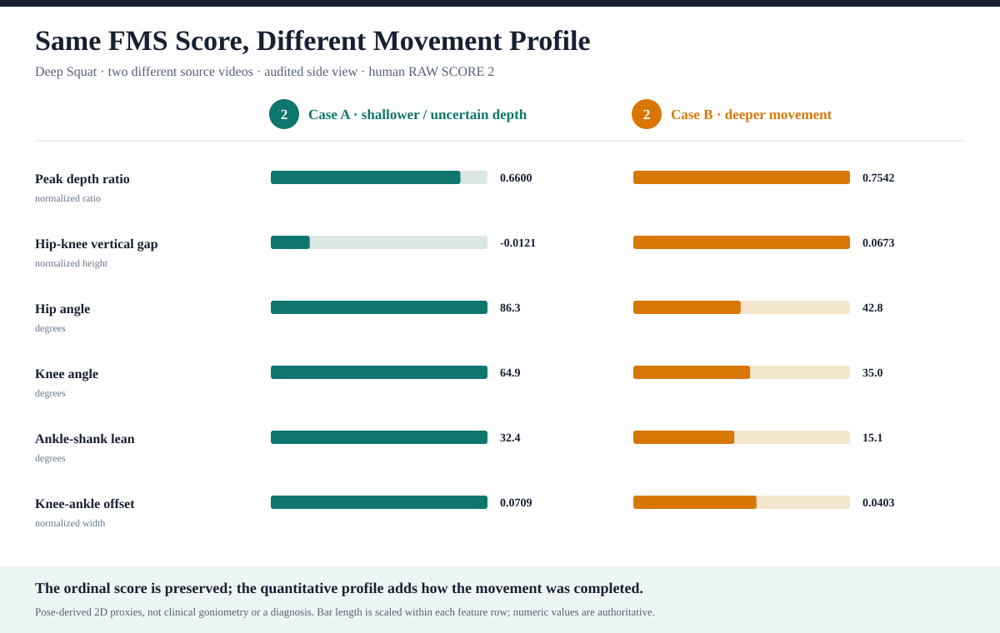
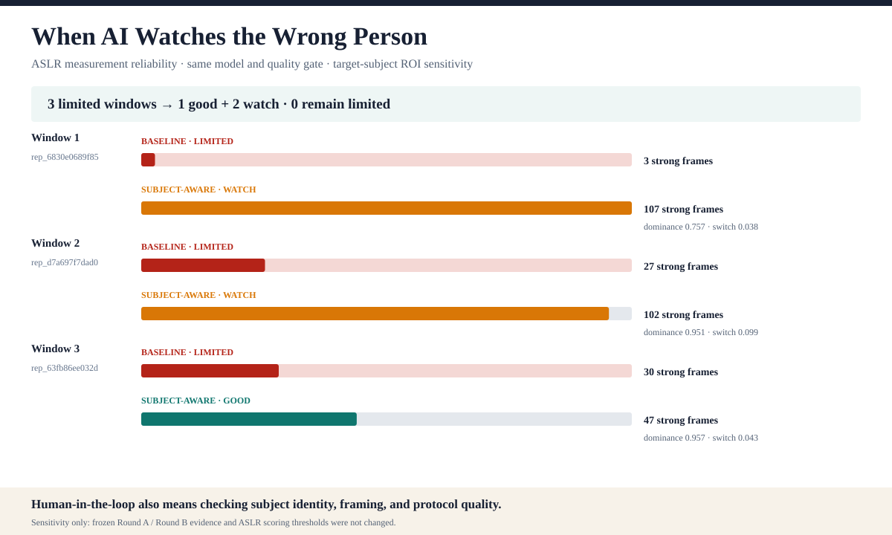

# AI-FMS Phase I 案例组合

日期：2026-08-10

状态：application candidate；Round B pending

## 组合原则

本组合不挑选四个都“证明 AI 有效”的案例，而是分别展示项目的发现、质量控制和边界：

1. Deep Squat：同分背后的连续 movement-profile 差异。
2. ASLR：subject selection 如何影响 pose evidence reliability。
3. Hurdle Step：camera-view metadata 如何限制解释。
4. Rotary Stability：证据不足时为什么只显示 features、不硬给 AI 总分。

所有图均不包含人物截图、源文件名、绝对路径或诊断性结论。

## 1. Deep Squat 主案例

两条来自不同源视频、审计后均为 side view 的 Deep Squat rep，由两位 reviewer 在
Round A 均判为 RAW SCORE 2。分数相同，但定量参数不同：

| Feature                 |  Case A | Case B | Unit              |
| ----------------------- | ------: | -----: | ----------------- |
| `peakDepthRatio`        |  0.6600 | 0.7542 | normalized ratio  |
| `hipKneeVerticalGap`    | -0.0121 | 0.0673 | normalized height |
| `hipAngleDegrees`       |    86.3 |   42.8 | degrees           |
| `kneeAngleDegrees`      |    64.9 |   35.0 | degrees           |
| `ankleShankLeanDegrees` |    32.4 |   15.1 | degrees           |
| `maxKneeAnkleOffset`    |  0.0709 | 0.0403 | normalized width  |

可报告结论：FMS ordinal score 保留规则结果；AI-FMS quantitative profile 进一步记录
动作完成程度和策略。它不把参数差异命名为功能障碍。

## 2. ASLR 测量可靠性案例

三个原 `limited` 窗口经 target-subject ROI / crop 后均不再 limited：

| Rep                | Baseline | Sensitivity | Strong frames |
| ------------------ | -------- | ----------- | ------------: |
| `rep_6830e0689f85` | limited  | watch       |       3 → 107 |
| `rep_d7a697f7dad0` | limited  | watch       |      27 → 102 |
| `rep_63fb86ee032d` | limited  | good        |       30 → 47 |

可报告结论：部分失败来自 AI 跟错主体或画面裁剪，而不是视频中完全没有动作信号。
该结果不覆盖冻结 evidence，也不构成 score accuracy improvement。

## 3. Hurdle Step 方法案例

两条 RAW SCORE 2 的 rep 来自不同视频，但审计机位分别为
`mixed` 与 `front`。因此参数
差异不能全部归因于动作本身。它展示了 view-aware feature gate 和 metadata lineage 的
必要性，不作为同机位 movement-profile 主证据。

## 4. Rotary Stability 边界案例

正式样本中的 8 条 Rotary Stability rep 全部保留定量 features，
但 AI RAW SCORE coverage 为 0/8。这不是功能
缺失的掩饰，而是项目的 fail-closed 原则：当前规则证据不足时，宁可展示可追溯特征，
也不输出未经验证的综合分数。

## 申请展示顺序

1. 先用 Deep Squat 图解释项目的科学价值。
2. 再用 ASLR 图解释 human-in-the-loop 和工程严谨性。
3. 口头补充 Hurdle 与 Rotary，说明系统知道自己的边界。

## 发布边界

- 当前图表可作为无人物媒体的 application candidate。
- 仍需完成最终文案、学校平台尺寸和无障碍替代文本检查。
- 不声称医学诊断、临床验证、伤病预测或 validated impairment subtype。
- Round B 完成后只更新 study 结果，不事后改写这些案例的数据来源和质量边界。
