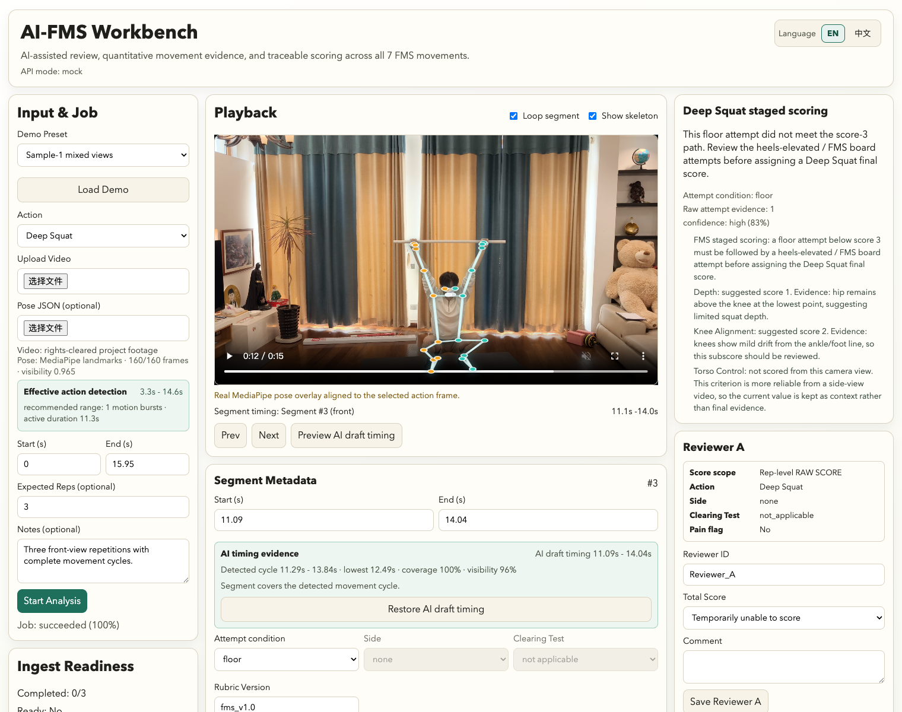
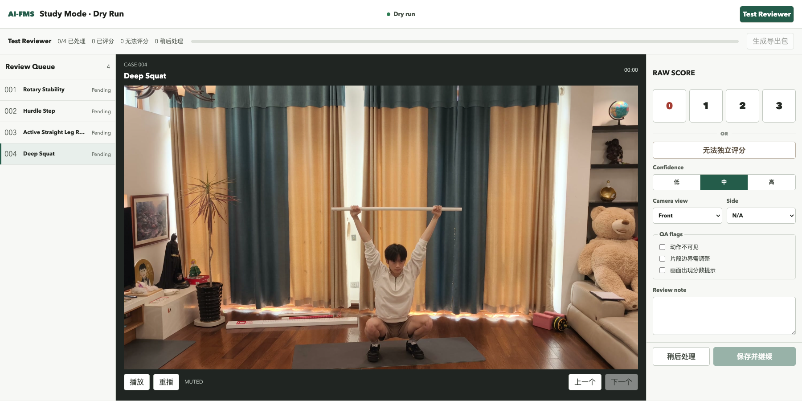
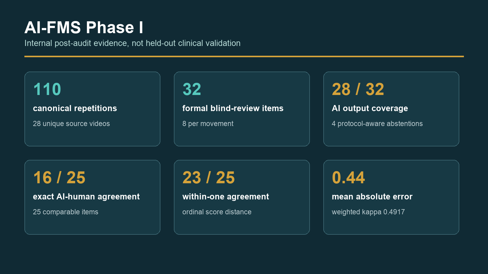

# Building AI-FMS with Codex: What AI Automated and What Human Judgment Had to Own

I started this project with a movement-screening problem, not an AI demo.

I had completed Functional Movement Screen training and spent time practicing how the seven movements are observed and scored. The more videos I reviewed, the more I noticed how much of the work happens around the score. A movement passes quickly. The reviewer may need to replay one repetition, compare sides, check a protocol condition, or remember exactly where the trunk, knee, hip, or ankle changed. A final 0-3 score is useful, but it also compresses most of that evidence.

That became the goal of AI-FMS: build a video-review system that helps a human reviewer see, organize, and preserve more of the movement without pretending that AI can replace protocol knowledge.

The current system covers all seven FMS movements. It can ingest video, define an analysis range, segment repetitions, loop a selected repetition, show a pose overlay, calculate movement-specific angles and relative distances, generate an explainable first-pass suggestion, abstain when evidence is insufficient, collect independent reviewer scores, support adjudication, and export a traceable record.

I used OpenAI Codex throughout the project. It accelerated the work enormously. It also produced results that looked finished before they were trustworthy. The most useful lesson was learning to separate what AI could automate from what humans still had to own.

## What Codex was genuinely good at

### 1. Reading an unfamiliar codebase and extending existing patterns

AI-FMS grew from an earlier calibration interface. Codex could inspect the React/Vite application, data schemas, mock API, scoring modules, export paths, and tests before making changes. That made it possible to reuse the existing workbench instead of creating a second application for research mode.

This mattered because the system eventually needed several views of the same underlying record: a normal Workbench, a blind Study Mode, exports for analysis, and a database for audit. A local interface change was not complete unless the same field survived through the schema, storage, export, and analysis pipeline. Codex was useful at tracing those connections and generating the repetitive adapter and test work.

### 2. Turning movement rules into inspectable software

Pose estimation alone does not produce an FMS score. The project needed movement-specific logic: which landmarks matter, which side is active, which events define a complete repetition, when camera view makes a quantity unreliable, and when protocol information cannot be inferred from pixels.

Codex helped convert these decisions into scoring functions, quality gates, explanations, and tests. Deep Squat could use joint and trunk relationships around the deepest phase. ASLR needed active-leg height, stationary-leg control, side assignment, and confidence. Hurdle Step needed a trajectory rather than one frame. Rotary Stability eventually required full-cycle event logic instead of a convenient threshold.

The key was that I could ask the system to show its work. A suggestion is accompanied by the evidence and reason that produced it. If the required condition is unresolved, the system can abstain.

### 3. Building the research plumbing

The least glamorous part of a research project is often where the most errors hide: stable IDs, duplicate ingests, source-video relationships, randomized presentation order, blind review state, export compatibility, and repeated calculations.

Codex helped build scripts to reconcile 28 unique source videos, 29 ingestion records, and 110 canonical repetitions. It also helped create a 32-repetition formal review set, collect two blinded review rounds, compare reviewer outputs, and generate reproducible figures and tables.

At the release point, the repository quality gate included 340 automated tests plus linting, formatting, and three production entry builds. That did not prove scientific validity, but it made the engineering record much easier to trust and audit.

## Where the project would have gone wrong without human review

### 1. A database field can be structured and still be wrong

Camera view was stored as metadata, so it was tempting to treat it as reliable. A visual audit found that 45 of the 110 canonical repetitions needed camera-view correction.

This was an important reality check. AI can propagate a field perfectly through the database, interface, and export while the original field is incorrect. The fix was not a better serializer. It was human visual review plus stronger validation rules.

### 2. Development labels are not independent evidence

During development, the system accumulated 92 legacy numeric AI suggestions. They looked like a large evaluation set. They were not. Some were produced while thresholds were being tuned, and some could be connected to labels or source context.

We separated those values from the formal evidence layer. The final paper reports them only as development history, not as independent validation. That choice reduced the size of the headline result, but made the result more honest.

### 3. Rotary Stability could not be completed with one more threshold

Rotary Stability was the last movement to receive a full first-pass scoring path. A simple angle cutoff would have made the product checklist look complete, but it would not have represented the movement.

The score depends on a sequence: pattern and side, hand and knee behavior, contact, extension, balance, and return. Human review showed overlap between the available pose features for scores 1 and 2. The implementation had to move from peak-value classification to cycle-level event detection and retain an abstention path.

That work took longer, but it also became one of the clearest examples of why human-in-the-loop design matters. Sometimes the right AI output is not a number. It is a structured explanation of why the evidence is incomplete.

### 4. Blind review means blind to the AI too

We ran two review rounds with two reviewers on 32 repetitions. Both reviewers were blind to filenames, historical labels, previous answers, the other reviewer's answer, audio, AI scores, and pose evidence.

At one point, it was easy to describe Round B as an AI-assisted review simply because it happened after more AI development. That would have been wrong. The interface remained blind. Round B measured repeated human review, not the effect of AI assistance.

That correction changed the claim we could make. We can report reviewer stability and a parallel AI-human comparison. We cannot claim that showing AI evidence improved speed, confidence, or accuracy. That needs a future randomized assistance study.

## What the Phase I result actually says

The formal set contained 32 repetitions, eight each for Deep Squat, Hurdle Step, ASLR, and Rotary Stability. In Round B, the two reviewers agreed on final status for all 32 items and matched exactly on all 26 items that both scored numerically. Six items were mutually considered not independently scorable under the protocol.

The locked AI produced output for 28 of 32 items and abstained on four staged-protocol Deep Squat cases. Among 25 items with comparable human scores:

- exact agreement was 16/25;
- within-one agreement was 23/25;
- mean absolute error was 0.44; and
- linear weighted kappa was 0.4917.

I see this as a useful first result, not a victory lap. The AI often lands close to the human reference, but it is not ready to replace a trained reviewer. The evaluation is internal and post-audit, not held-out clinical validation.

The more interesting result may be what survives beneath the score. Two Deep Squat repetitions can share a score while showing different depth and trunk-knee-hip strategies. Hurdle Step repetitions can reach a similar peak position through different movement paths. ASLR can preserve bilateral trajectory and stationary-leg evidence. Rotary Stability can show which cycle event is missing even when it refuses a total score.

## The responsibility map that worked for us

**Codex and automated tools handled:**

- codebase exploration and repetitive implementation;
- schema propagation and adapters;
- pose-feature and scoring prototypes;
- test generation and release checks;
- data reconciliation and analysis scripts;
- figure and document production; and
- alternative explanations and edge-case prompts.

**Humans had to own:**

- the FMS protocol and what a score means;
- pain, clearing, staged conditions, and unscorable decisions;
- the study design and blinding rules;
- privacy and publication rights;
- identification of label leakage and contaminated evidence;
- visual correction of metadata and pose failures;
- interpretation of the results; and
- every public claim.

The boundary is not "AI does code, humans do sports science." Both sides of the project overlapped. Codex could suggest a scoring rule, and a human could improve the code. But responsibility had to remain identifiable.

## Five things I would do again

1. **Design abstention from the beginning.** Do not add it after the model fails. Make "insufficient evidence" a first-class output.
2. **Separate development evidence from evaluation evidence.** A larger number is not better if the labels influenced the system.
3. **Keep the human review interface independent from the AI interface.** Blinding needs to be a technical property, not a promise in the method section.
4. **Treat structured metadata as a hypothesis until it is audited.** Databases preserve mistakes very efficiently.
5. **Ask the AI to produce tests and provenance, not only features.** The most valuable automation often sits around the model.

## What comes next

The next step is a small prospectively collected, permission-cleared held-out set. We also want a separate randomized study comparing review with and without visible AI evidence. That would let us measure whether the interface changes review time, confidence, or decisions without weakening the independent human reference.

We are preparing a privacy-safe public demo and an ACM IUI 2027 demonstration submission focused on explanation, abstention, and reviewer control.

- Preprint and methods: [ZENODO DOI URL]
- Public repository: [GITHUB URL]
- Privacy-safe demo: [DEMO URL]
- 4:30 project overview: [VIDEO URL]

I would especially appreciate feedback from people building AI systems where a trained human must remain responsible: How do you evaluate abstention? How do you keep development labels from quietly becoming test labels? What interface patterns have helped users challenge an AI suggestion rather than simply accept it?

---

**Disclosure:** OpenAI Codex assisted implementation, testing, analysis tooling, figure preparation, editing, and portions of this draft under human direction. Human authors reviewed the evidence, corrected errors, verified the numbers and references, and take responsibility for the final content. AI-FMS is a movement-screening and review project, not a medical diagnostic or injury-prediction system.
